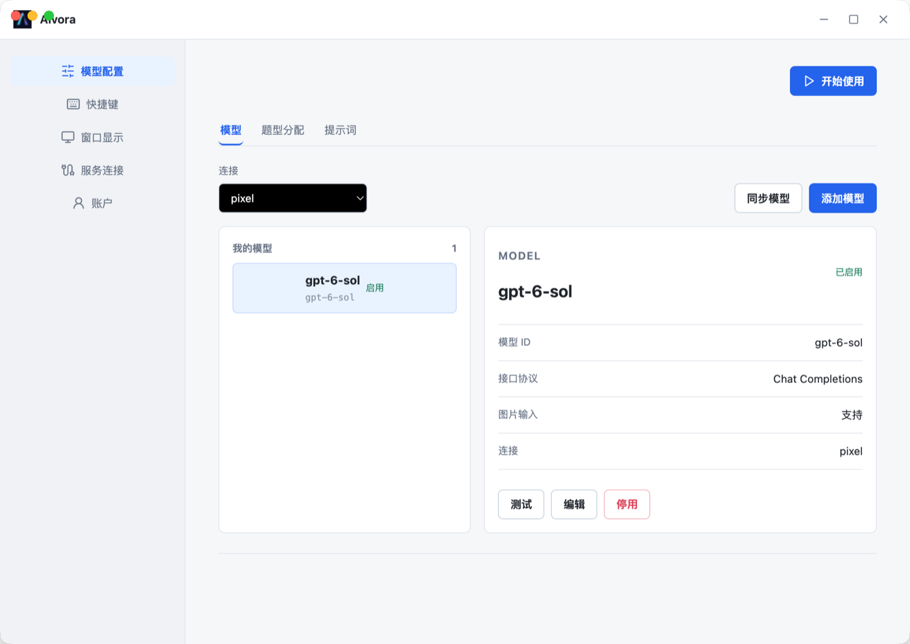
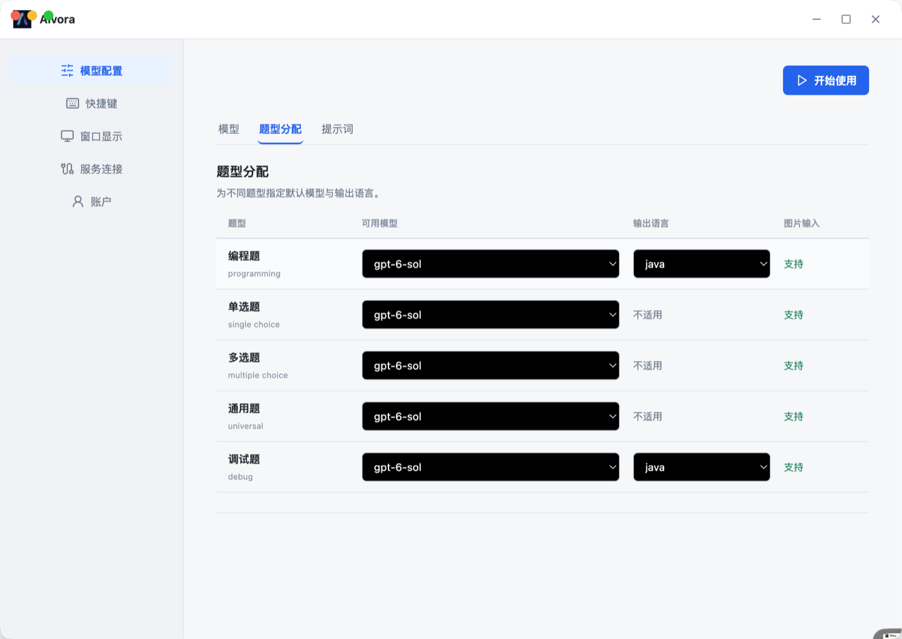
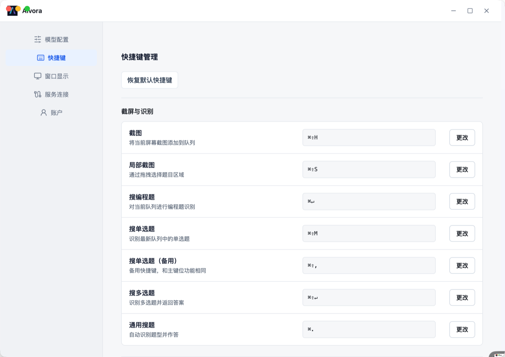
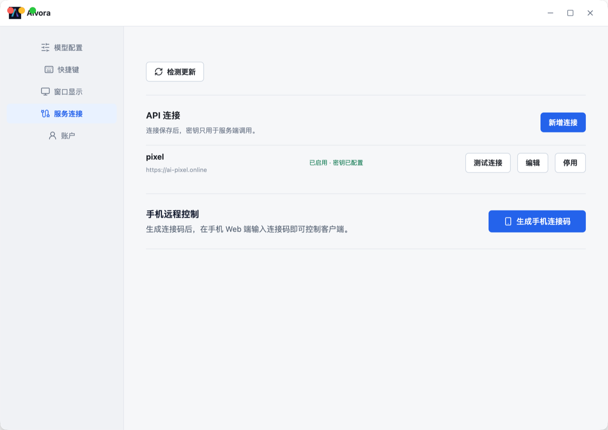
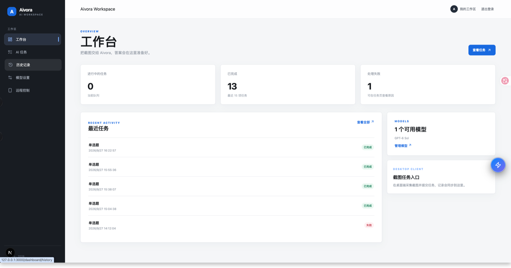
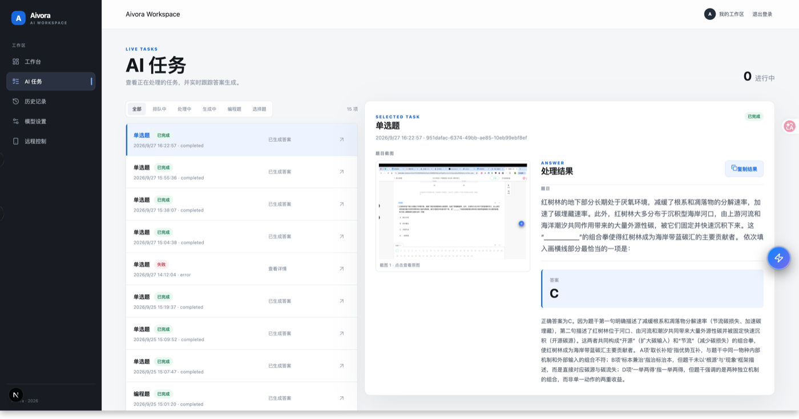
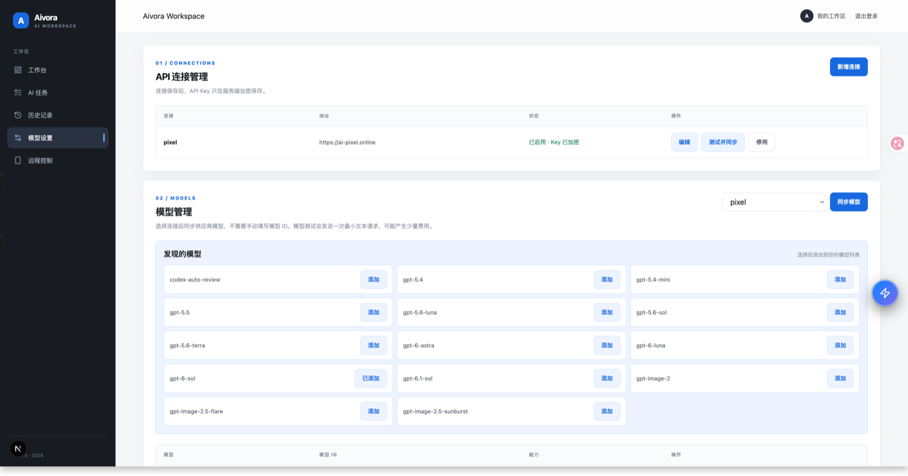
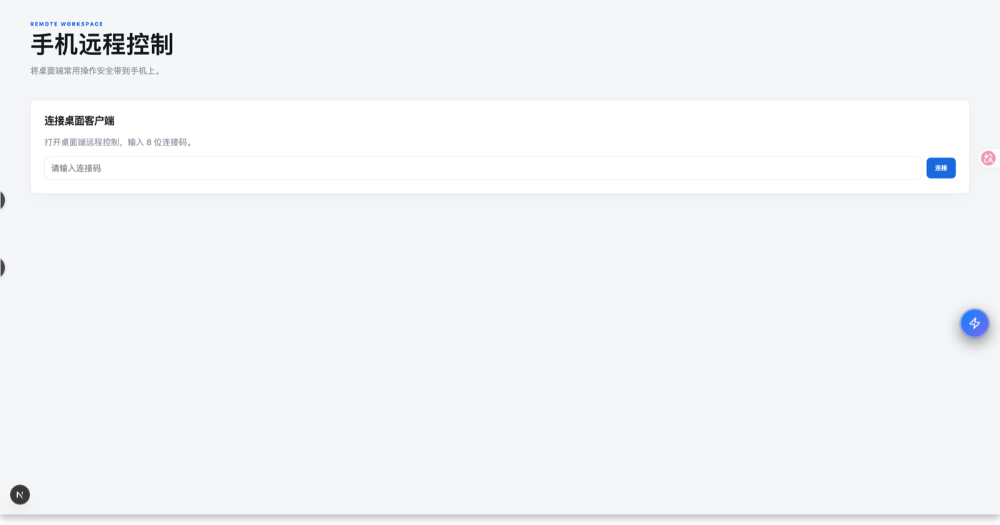

# Aivora

Aivora 是一套可自主部署的 AI 截图任务处理工具，由 Electron 桌面客户端、Web 管理端、FastAPI 服务和异步任务 Worker 组成。用户可通过全局快捷键采集一张或多张截图，按题型调用自有 AI 模型，并在桌面浮窗中实时查看处理结果。

> 当前项目仍在持续完善。公开体验环境使用 HTTP，仅适合功能试用，请勿提交敏感截图、账号密码或生产 API Key。

## 在线体验与下载

| 入口 | 地址 | 说明 |
| --- | --- | --- |
| Web 管理端 | [http://43.133.80.249](http://43.133.80.249) | 注册、登录、任务记录、模型与远程控制 |
| 注册账号 | [立即注册](http://43.133.80.249/register) | 桌面客户端与 Web 端共用账号 |
| 最新客户端 | [GitHub Releases](https://github.com/liutongzhao/aivora/releases/latest) | 在 Assets 中选择对应系统安装包 |
| 全部版本 | [版本列表](https://github.com/liutongzhao/aivora/releases) | 查看历史版本、更新说明和安装文件 |

客户端安装包说明：

- macOS：下载 `.dmg` 文件。
- Windows：下载 `.exe` 文件。
- 如果最新 Release 暂时没有对应平台文件，请展开 Assets 或查看最近一个 Desktop Release；构建中的版本需要等待 GitHub Actions 完成。
- 当前 macOS 安装包尚未进行 Apple Developer 签名与公证，首次启动可能需要前往“系统设置 -> 隐私与安全性”选择“仍要打开”。

## 产品截图

### 桌面客户端

客户端将高频能力集中在模型配置、题型分配、提示词、快捷键、窗口显示和服务连接中。考试浮窗默认通过全局快捷键操作，减少鼠标交互对当前窗口的影响。

#### 模型管理



#### 题型与模型分配



#### 快捷键管理



#### 服务连接



### Web 管理端

Web 端用于账号管理、任务查询、模型配置同步和远程控制，同时为管理员提供用户、任务和服务状态视图。

#### 工作台与任务概览



#### AI 任务详情



#### 模型连接与同步



#### 手机远程控制



## 核心功能

### 桌面客户端

- 使用全局快捷键截取全屏或选择区域，不需要离开当前应用。
- 支持连续采集多张截图，并以一个任务提交给多模态模型。
- 内置通用、编程、单选、多选和调试等题型，可配置题型默认模型。
- 管理 OpenAI 兼容连接、模型、图片输入能力和自定义提示词。
- 通过 SSE 增量显示任务进度和模型输出。
- 支持浮窗显示、窗口穿透、内容滚动、清空结果等快捷操作。
- 检查客户端新版本，并从 GitHub Releases 获取更新。

### Web 管理端

- 账号注册、登录和会话管理。
- 查看进行中任务、历史任务、答案与失败原因。
- 管理 AI 连接、模型、题型路由和提示词，并与客户端同步。
- 使用临时连接码与桌面客户端配对，远程触发已授权操作。
- 管理员查看用户、任务、模型目录、审计信息和服务健康状态。

### 服务端

- FastAPI 提供认证、配置、文件、任务、SSE 和管理接口。
- Celery Worker 异步调用 OpenAI 兼容模型，避免长任务阻塞 API。
- PostgreSQL 保存账号、配置、任务、答案和审计数据。
- Redis 承担任务队列和实时事件流。
- MinIO 保存私有截图对象，应用服务不依赖本机截图目录。

## 快速使用

1. 在 [Web 管理端](http://43.133.80.249) 注册账号。
2. 从 [GitHub Releases](https://github.com/liutongzhao/aivora/releases/latest) 下载并安装客户端。
3. 启动客户端并使用同一账号登录。
4. 在“服务连接”中添加 OpenAI 兼容接口，填写接口地址和 API Key。
5. 同步或手动添加模型，并正确设置模型是否支持图片输入。
6. 在“题型分配”中为不同题型选择默认模型，在“提示词”中按需调整指令。
7. 在“快捷键”中确认截图、提交、窗口显示等按键没有与系统或其他软件冲突。
8. 使用截图快捷键采集内容，继续截图可加入多张图片，随后提交任务并查看流式结果。

### 图片输入说明

“支持图片”表示客户端允许把截图作为该模型的视觉输入发送。只有模型本身支持视觉能力时才应启用；勾选不会让纯文本模型自动获得识图能力。配置不正确时，模型服务可能返回不支持图片或请求格式错误。

### 系统权限

macOS 首次使用时通常需要授予：

- **屏幕录制**：用于全屏和区域截图。
- **辅助功能**：用于全局快捷键、窗口控制等桌面能力。

修改系统权限后应完全退出并重新启动客户端。若快捷键没有响应，还应检查是否与输入法、系统快捷键或其他常驻软件冲突。

## 系统架构

```text
Electron 客户端                  Next.js Web
截图 / 快捷键 / 浮窗             账号 / 配置 / 任务
        |                              |
        +---------- HTTP / SSE --------+
                       |
                  FastAPI API
             /         |          \
      PostgreSQL     Redis        MinIO
      账号与任务      队列与事件    私有截图
                       |
                 Celery Worker
                       |
              OpenAI 兼容模型服务
```

一次截图任务的主要流程：

1. Electron 主进程响应全局快捷键并完成截图，Renderer 维护待提交截图队列。
2. 客户端向 `/api/ai/*` 接口提交截图、题型和语言等参数。
3. API 将截图写入 MinIO，在 PostgreSQL 创建任务，并投递到 Celery 队列。
4. Worker 根据用户模型、题型路由和提示词配置调用 AI 服务。
5. Worker 通过 Redis Stream 发布进度、内容、完成或错误事件。
6. 客户端通过 SSE 实时接收结果，最终答案与解析状态持久化到 PostgreSQL。

## 仓库结构

```text
apps/
  desktop/           Electron + React + Vite 桌面客户端
  web/               Next.js 用户端、管理端和远程控制
services/
  backend/           FastAPI、Celery Worker、Provider 和数据库迁移
deploy/              开发/生产 Docker Compose 与 Nginx 配置
scripts/             本地服务启停和健康检查脚本
tests/               后端、跨服务和端到端测试
docs/                架构、开发、验收和设计文档
```

各前端项目独立管理依赖。仓库根目录不需要 `node_modules/`，也不应提交任何 `node_modules/`、构建产物、日志或本地环境文件。

## 本地开发

### 环境要求

- Node.js 22 及 npm
- Python 3.12
- Docker Engine 与 Docker Compose v2
- macOS 桌面开发需授予屏幕录制和辅助功能权限

### 启动基础设施

```bash
docker compose -p aivora --project-directory "$PWD" \
  -f deploy/compose.dev.yml up -d postgres redis minio flyway
```

### 配置服务端

```bash
cp services/backend/.env.example services/backend/.env.local
python -m pip install -e services/backend
```

编辑 `services/backend/.env.local`，配置数据库、Redis、MinIO、`AIVORA_MASTER_KEY` 和初始管理员信息。该文件仅用于本地环境，不应提交到 Git。

### 安装前端依赖

```bash
npm install --prefix apps/desktop
npm install --prefix apps/web
```

### 启动完整开发环境

```bash
./scripts/start-aivora.sh
./scripts/check-aivora.sh
```

停止当前项目服务：

```bash
./scripts/stop-aivora.sh
```

也可以分别运行前端：

```bash
npm --prefix apps/desktop run dev
npm --prefix apps/web run dev -- --hostname 127.0.0.1 --port 3000
```

本地默认地址：

| 服务 | 地址 |
| --- | --- |
| Electron Renderer / Vite | `http://127.0.0.1:54321` |
| Next.js Web | `http://127.0.0.1:3000` |
| FastAPI | `http://127.0.0.1:18000` |
| 存活检查 | `http://127.0.0.1:18000/health/live` |
| 就绪检查 | `http://127.0.0.1:18000/health/ready` |
| PostgreSQL | `127.0.0.1:15439` |
| Redis | `127.0.0.1:16379` |
| MinIO API | `127.0.0.1:19000` |
| MinIO Console | `http://127.0.0.1:19001` |

完整验收流程见 [本地开发与验收](docs/%E6%9C%AC%E5%9C%B0%E5%BC%80%E5%8F%91%E4%B8%8E%E9%AA%8C%E6%94%B6.md)。

## 测试与构建

```bash
# 桌面客户端
npm --prefix apps/desktop test
npm --prefix apps/desktop run typecheck
npm --prefix apps/desktop run build

# Web 端
npm --prefix apps/web test
npm --prefix apps/web run build
npm --prefix apps/web run e2e

# 后端
pytest -q
python -m compileall -q services/backend/app

# Compose 配置
docker compose --project-directory "$PWD" \
  -f deploy/compose.dev.yml config --quiet
```

Web 开发服务和 Web 构建共用 `.next` 缓存，不要同时运行。

## Docker Compose 自托管

生产环境建议使用 Linux x86_64 服务器、Docker Compose v2、Nginx 和独立域名。服务器只需保存生产 Compose、Nginx 配置、非入库 `.env` 与持久卷；应用镜像由 CI 构建并推送到 GHCR。

### 准备部署目录

以下路径与账号均为示例，可按服务器规范调整：

```bash
sudo mkdir -p /opt/aivora
sudo chown <deploy-user>:<deploy-user> /opt/aivora
cp deploy/.env.prod.example /opt/aivora/.env
chmod 600 /opt/aivora/.env
```

必须替换示例密码、`AIVORA_MASTER_KEY`、管理员信息和镜像仓库配置。生产 `.env` 不应上传 GitHub。

私有 GHCR 镜像需要在服务器使用只读 Token 登录：

```bash
echo "$GHCR_READ_TOKEN" | docker login ghcr.io \
  -u <github-user-or-organization> --password-stdin
```

同步 `deploy/` 中的生产文件后，执行：

```bash
/opt/aivora/scripts/deploy.sh <git-commit-sha>
curl http://127.0.0.1/health/live
curl http://<server-host>/health/ready
```

### GitHub Actions Secrets

在仓库 `Settings -> Secrets and variables -> Actions` 中配置：

| Secret | 用途 |
| --- | --- |
| `DEPLOY_HOST` | 部署服务器主机名或 IP |
| `DEPLOY_USER` | 最小权限部署账号 |
| `DEPLOY_PORT` | SSH 端口，通常为 `22` |
| `DEPLOY_SSH_KEY` | 专用于 CI 部署的 SSH 私钥 |

服务端 Release workflow 在版本 Tag 或手动触发时构建 Web 与 Backend 的 `linux/amd64` 镜像，以 Git commit SHA 作为不可变版本，并通过 SSH 完成迁移、更新和健康检查。回滚时执行：

```bash
/opt/aivora/scripts/rollback.sh <previous-git-commit-sha>
```

## 客户端发布与更新

`.github/workflows/desktop-release.yml` 负责构建 macOS 与 Windows 安装包。推送符合 `desktop-v*` 的 Tag，或在 GitHub Actions 中手动运行 workflow，即可创建 GitHub Release 并上传安装文件。

推荐发布步骤：

```bash
git tag desktop-v0.2.0
git push origin desktop-v0.2.0
```

客户端通过 Releases 检查新版本。正式公开分发前，建议补齐：

- macOS Developer ID 签名与 Apple 公证。
- Windows 代码签名证书。
- HTTPS 下载与服务地址。
- 清晰的版本号、更新日志和回滚策略。

## 安全注意事项

- 不要提交 `.env`、API Key、数据库密码、对象存储密钥和 `AIVORA_MASTER_KEY`。
- 不要在截图、Issue、日志或任务结果中暴露 API Key 和敏感业务数据。
- 生产环境必须使用 HTTPS；HTTP 会以明文传输登录凭据、会话和截图。
- PostgreSQL、Redis 和 MinIO 不应直接暴露到公网。
- 建议为每位用户创建独立的模型凭据，并限制额度和可用模型。
- 发布前应备份 PostgreSQL 与 MinIO，并验证数据库迁移和回滚流程。
- 桌面端权限仅在需要时授予，公共或受管设备上使用后应退出账号。

## 开源协议

桌面客户端当前声明为 `AGPL-3.0-or-later`。对外发布源码、容器镜像或安装包前，请同时核对仓库 LICENSE、第三方依赖许可及所接入模型服务的使用条款。
